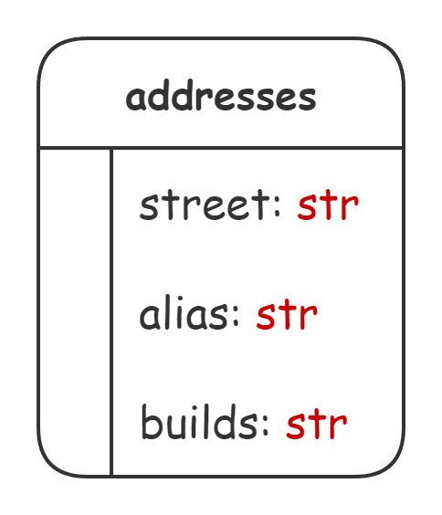

## 
 `chat's messages parser`

#### Start

- _Clone this repository._
- _Create_ __`.env`__ _file by_ __`.env.example`__ _at root directory, with your variables values._
- _Add database with name_ __`db.sqlite3`__ _._
- _Build and run project with_ __`docker compose up -d --build`__ _._ _Add_ __`START_DATE`__ _key to begining command with oldest date parse period, format_ __`YYYY-MM-DD`__ _._

_Project will be start, parse chat, and reply valid messages to your own chat._

#### Database structure

